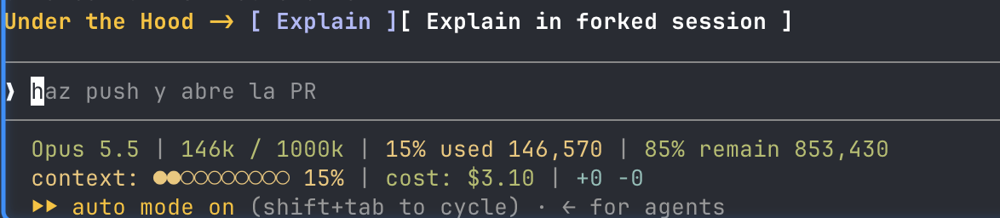

# under-the-hood


Agents let us ship more than ever. We fix things, build things, close tickets - and often
could not say how any of it works underneath. The output grows; what we actually know does
not. It feels like working harder while standing still in your career.

This plugin is one way to fix that for Claude Code: while you work, the agent explains the
mechanism behind what it is doing, at the depth your own skill profile says you need, and
keeps a backlog of the gaps worth studying.

It is deliberately small. The idea matters more than the package: decide what you want to
learn and how you want it explained, then tell your agent. If you would rather start from
something ready-made, here it is.

## What you get

- **A skill profile** - `~/.claude/learning/profile.yaml`. The areas *you* chose to learn
  about, each with a 0-5 level, your background, and your language.
- **Explanations at your depth** - `/under-the-hood:explain <PR | file | subsystem | concept>`
  reads the real code and explains what happens, why it is done that way, and what would break
  otherwise. Level 1 gets first principles; level 4 gets only what is surprising.
- **Visual explanations** - for a PR or a subsystem, explain writes one interactive HTML page:
  a tree of claims along the request path, each proved by a call tree, state machine, flow or
  the real code lines, with what would break marked as risks. Comment on any line and paste the
  response back. Needs `node`; the page runtime is vendored from
  [html-plan](https://github.com/anthropics/claude-plugins-community/tree/main/html-plan) (MIT).
- **Explain by default** (optional) - the same explanation rides along whenever the agent makes
  an implementation decision, not only when you ask.
- **Track gaps** (optional) - levels move on real evidence, and when you touch a weak area the
  agent offers one study session for `~/.claude/learning/backlog.md`.
- **Explain band** (on by default) - after each answered turn, a row above the prompt offers to
  explain what just happened, either in the conversation or in a session of its own. In the
  desktop app the second button offers a suggested-task chip carrying a handoff, so one click
  opens an independent session; in the terminal it copies a `claude --resume <id> --fork-session`
  command (POSIX shells; PowerShell on Windows) that forks this conversation in a new tab.

  

- **A radar view** - `~/.claude/learning/profile.html`, a static page (no server) that draws the
  profile and lets you click levels back into the YAML.

## Install

```
/plugin marketplace add eecarres/under-the-hood
/plugin install under-the-hood@under-the-hood
```

Start a new session. A `SessionStart` hook notices there is no profile yet and offers
`/under-the-hood:setup`, a guided 11-step setup: language, background (paste a CV or a LinkedIn
URL if you like), areas discovered from your recent work in GitHub, Jira or Linear, optional
self-rating, and which behaviours to switch on. Nothing has to be right the first time -
everything can be changed later.

## How it fits together

| Piece | What it does |
|---|---|
| `hooks/session-start.sh` | Every session: no profile -> offer setup; unfinished -> offer to resume; done -> tell the agent which language to explain in. |
| `hooks/register.ts` | The explain band, a Claude Code mod: hidden only when the profile says `explain_band: false`. |
| `skills/setup` | Builds the profile step by step, writing each answer before the next question. |
| `skills/explain` | Explains a named target at your depth, then updates the profile and backlog. |
| `skills/explain/runtime` | The html-plan page runtime and its packer, copied unchanged (see `NOTICE.md`). |
| `assets/claude-md-block.md` | The always-on contract, added to `~/.claude/CLAUDE.md` between markers only if you agree. |

## License

MIT
